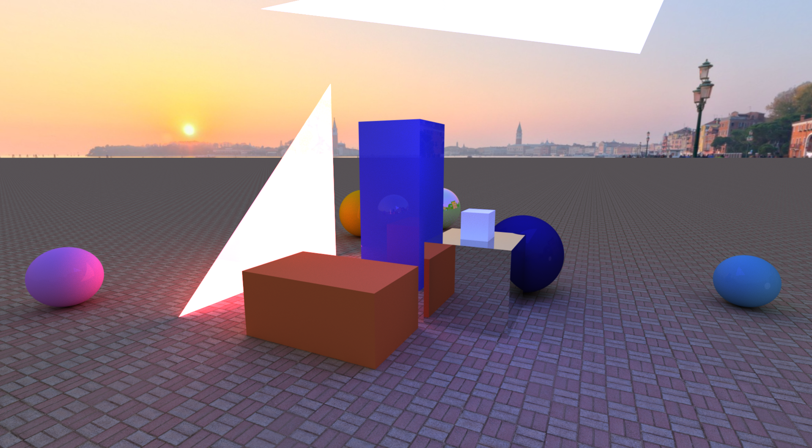

# GPU Ray Tracer
GPU Ray Tracing application based on my OpenGL Compute Engine.

  

 
## Dependencies

* OpenGL
* GLFW
* GLEW
* [stb_image](https://github.com/nothings/stb)
* [OpenGL Compute Engine](https://github.com/DawidPietrykowski/ComputeEngine)

## Build

Specify these root directories for dependencies in [make.bat](make.bat) script:
* GLFW_ROOT
* GLEW_ROOT
* stb_image_ROOT
* ComputeEngine_ROOT

Run [make.bat](make.bat) script.

## Config files

Each scene/configuration is described in a config file.

Example scenes are located in [/configs](configs) directory.

All available parameters are specified in [config_template.txt](config_template.txt).

## Usage

Pass chosen config file to the generated executable as an argument in command line. 

If no argument given, *config.txt* is picked.

## Features

* Wavefront (.obj) file import
* PNG, JPG, HDR texture import
* Object can be an imported triangle mesh, sphere or infinite plane
* Each scene is saved in a separate file
* Specular and diffuse reflections
* Physics based refractions
* Camera movement
* Screenshot saving

## Example images
Mesh             |  Refraction
:-------------------------:|:-------------------------:
  |  
Multiple meshes 1             |  Multiple meshes 2
  |  
Solar system 1             |  Solar system 2
  |  

## Keys
Camera

* UP - SPACE
* DOWN - CTRL
* LEFT - A
* RIGHT - D
* FORWARD - W
* BACKWARD - S

Window

* Screenshot - L
* Disable input to window - P
* Close application - ESC

## License and copyright

© Dawid Pietrykowski

Licensed under the [MIT LICENSE](LICENSE)